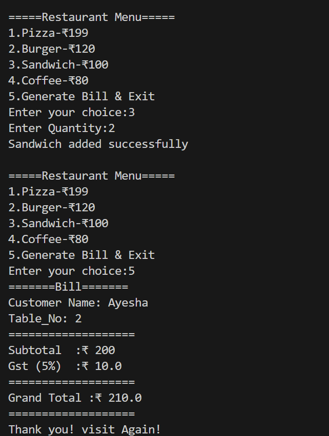

# 🍽️ Restaurant Billing System

A simple Python console-based Restaurant Billing System developed using Python basics.

## 📌 Features

- Customer name input
- Table number input
- Restaurant menu
- Order multiple items
- Quantity selection
- Automatic bill calculation
- 5% GST calculation
- Final bill generation
- Beginner-friendly code

## 🛠️ Technologies Used

- Python 3

## 📂 Project Structure

```
Restaurant-Billing-System/
│
├── restaurant_billing.py
├── README.md
├── LICENSE
├── .gitignore
└── screenshots/
    ├── input.png
    └── output.png
```

## 🚀 How to Run

1. Clone the repository

```
git clone https://github.com/ayeshamateen123/Restaurant-Billing-System.git
```

2. Open the project folder

3. Run

```
python restaurant.py
```

## 📸 Screenshots

### Menu


### Generated Bill



## 📖 Concepts Used

- Variables
- Input & Output
- if-elif-else
- while loop
- Arithmetic Operators
- User Input
- Bill Calculation

## 🎯 Future Improvements

- Save bill as a text file
- Admin panel
- Discount coupons
- Multiple payment methods
- Itemized bill
- GUI using Tkinter

## 👩‍💻 Author

**Ayesha Mateen**

B.Tech (Data Science)

Learning Python and building beginner-friendly projects.